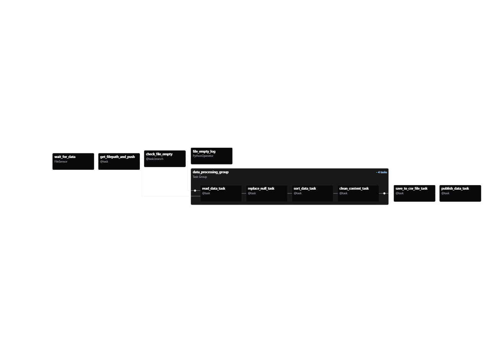

# Intro
Here I would like to share the problems that I faced while performing this task and their solutions.

# Main problems I've encountered
## 1. FileSensor errors
First part was about a DAG that used to receive data, transform it and load it with Airflow's help & the first problem I encountered was the FileSensor. Of course I use AI for better understanding of the project structure and for parsing things unfamiliar to me. And one of their disadvantages was  the use of irrelevant information. I worked with 3.0.6 Airflow Version and had a lot of mismatches with these components. Despite this, I figured out all troubles with this component and the task responsible for scanning directory and waiting for file with data started work correct.
### FileSensor UPDATE:
In previous commit I forgor to add scan the entire input folder. So, before I just recieve only one file with fixed name. Now I added the "get_filepath_and_push" task, that serves as a **bridge** for XCom, which, using Python **glob**, finds the absolute path to the file that FileSensor has detected, and forcibly pushes this path to XCom for use by subsequent tasks. This crutch was necessary because the version of my FileSensor, for some reason, did not allow uploading data to the XCom space and I couldn't fix it.

## 2. Replace all NaN values with "-"

The second thing that made me think about it was the replace_null_task, as I first thought. I noticed this problem when I had my DAG ready and when I started dealing with MongoDB queries. The first query that sounds like **"Top 5 frequently occurring comments"**. This query shows me the top five comments, and the third was the NaN value. I started to figure it out and, of course, first went to the replace_null task, tried to filter out values like "NaN", "Null", etc. But it didn't work. This query constantly returns NaN in third place. And then I remembered that this task precedes the clean_content task, which clears the "content" field AFTER replacing NaN. And that was the moment. In this task, I replaced the cleared content with an empty string "", and MongoDB interpreted this as NaN. After I made some changes to the clean_content task, everything worked correctly.

## 3. MongoDB
**MongoDB** is a **document-oriented NoSQL database** designed for storing, retrieving, and managing large volumes of unstructured or semi-structured data. Before this moment I haven't got any experience with NoSQL databases, so it was my first time. And first I didn't understand anything. I worked in MongoDB Compass as the task offered, and it's interface seemed to me not really intuitive. But after a few videos on YouTube, google surfing and AI asking I understand this query writing concept. It was really interesting experience.

# Additional Content
## DAG photo
